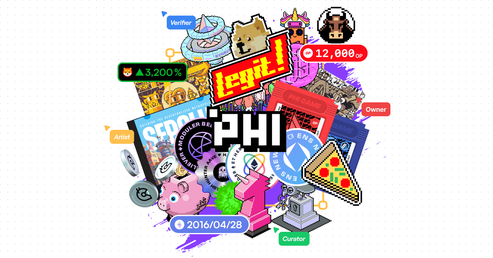

This is a [Next.js](https://nextjs.org) project bootstrapped with [`create-wagmi`](https://github.com/wevm/wagmi/tree/main/packages/create-wagmi).

## About

The Phi is a decentralized identity layer for web3, empowering people to express their on-chain identity.

## Sign Protocol

Evaluating artists In Phi Protocol, artwork created by artists is associated with credential NFTs. Community members can use [Ethsign](https://scan.sign.global/) to attest to these artworks, allowing them to evaluate the artists. When an artist who creates outstanding artworks receives a large number of attestations from members, the evaluation of that artist is visualized.

you can see more details:

- [schema](https://scan.sign.global/schema/SPS_ZVaqNYNHA7D_o6FuF4HEb)
- [snippet](./lib/ethsign.ts)

## Run Locally

Run `bun install` and `bun run dev` in your terminal, and then open [localhost:3000](http://localhost:3000) in your browser.

## Leave Feedback

We want to build with you. Join the [Phi discord](https://discord.gg/phi)
